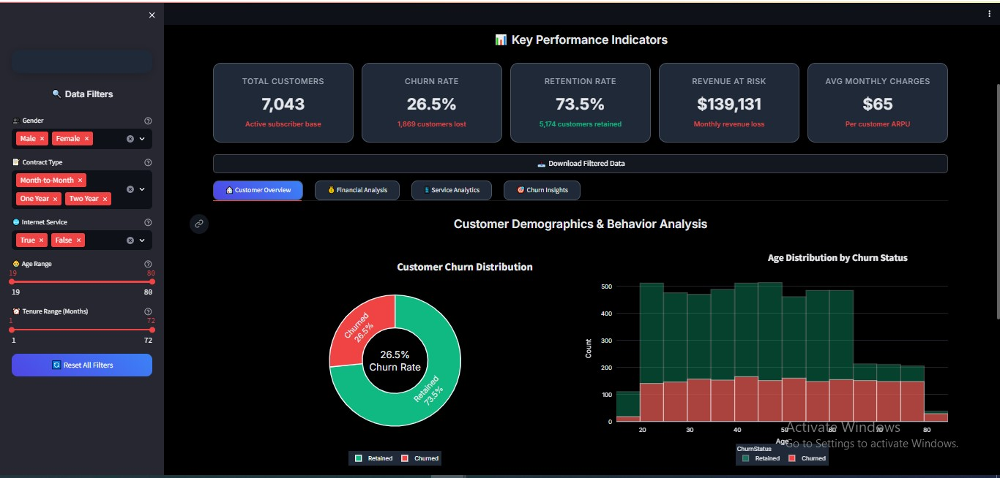
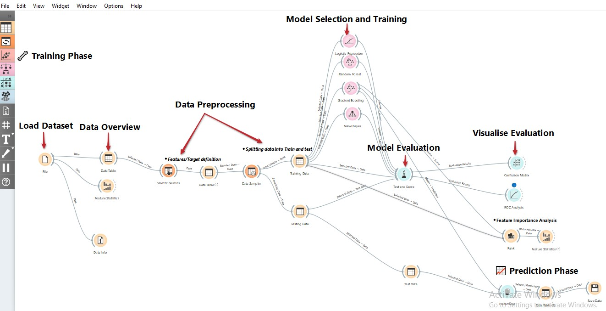

# 📉 Telco Customer Churn Analysis and Prediction

A full-stack data science project that explores, models, and visualizes customer churn patterns in the telecom sector using Python, Streamlit, and Orange. This solution blends real-world business strategy, predictive modeling, and an interactive dashboard to help telecom companies **retain customers and boost revenue**.


<p align="center">
  
  <br/>
  <em>Figure: Streamlit Dashboard Overview</em>
</p>

[Live demo](https://telco-churn-analysis-2.onrender.com/)
---

## 🚀 Project Highlights

- 📊 **End-to-End Workflow**: From raw data preprocessing to machine learning and dashboard deployment.
- 🤖 **Machine Learning**: Gradient Boosting model with **96% accuracy**, **0.990 AUC**, built using Orange Data Mining.
- 📈 **Interactive Streamlit Dashboard**: Analyze churn by age, contract type, gender, revenue impact, and more.
- 📌 **Actionable Insights**: Reveals customer segments most likely to churn and strategies to retain them.

---

## 🗃️ Dataset Used

- **Source**: [Kaggle - Telco Customer Churn](https://www.kaggle.com/datasets/blastchar/telco-customer-churn)
- **Rows**: 7,043 customers
- **Features**: 50+ variables including demographics, services, contract type, charges, and churn reason.

---

## 🛠️ Tools & Technologies

| Stack            | Description                                |
|------------------|--------------------------------------------|
| `Python`         | Data preprocessing, feature engineering    |
| `Pandas`, `NumPy`| Data manipulation and transformation       |
| `Matplotlib`, `Seaborn` | Exploratory Data Visualization     |
| `Streamlit`      | Interactive dashboard                      |
| `Orange ML`      | Visual machine learning and predictions    |

---

## 📂 Project Structure

```

📁 data/             # Raw and processed datasets
📁 notebooks/        # Jupyter notebook for data cleaning + EDA
📁 dashboard/        # Streamlit app source code
📁 modeling/         # Orange visual workflow for model building
📁 visuals/          # Project screenshots & visual artifacts
📄 churnupdate.docx  # Full report with insights and results
📄 README.md         # Project overview and documentation
📄 requirements.txt  # Python dependencies

````

---

## 📷 Sample Visuals

<p align="center">
  
  <br/>
  <em>Figure: Streamlit Dashboard Overview</em>
</p>

<p align="center">
  
  <br/>
  <em>Figure: Orange ML Pipeline for Churn Prediction</em>
</p>


<p align="center">
  
  <br/>
  <em>Figure: Orange ML Model Evaluation Result for Churn Prediction</em>
</p>

---

## 📌 Key Insights

- 💸 Month-to-month customers are 3x more likely to churn.
- 📉 Customers with high monthly charges (> $80) show greater churn risk.
- 📡 Fiber optic users had higher churn vs DSL or no internet.
- ⭐ Customer satisfaction score is the most influential predictor of churn.

---

## 💡 Recommendations

- Incentivize long-term contracts to reduce churn.
- Investigate service issues with fiber optic users.
- Offer loyalty bonuses to high-tenure or referred users.
- Monitor customers with satisfaction score ≤ 3 for early retention efforts.

---

## 🔍 How to Run This Project

1. **Clone the Repository**
```bash
git clone https://github.com/your-username/telco-churn-analysis.git
cd telco-churn-analysis
````

2. **Launch Jupyter Notebook for Cleaning & EDA**

```bash
jupyter notebook notebooks/telco_churn_analysis.ipynb
```

3. **Run the Streamlit Dashboard**

```bash
cd dashboard
streamlit run telco_churn_dashboard.py
```

4. **Open Orange Workflow**
   Open `telco_churn_workflow.ows` in [Orange Canvas](https://orangedatamining.com/)

---

## 📎 Resources

* 📄 Full Report: [Download churnupdate.docx](./churnupdate.docx)
* 📊 Dashboard Screenshots: `visuals/`
* 🎥 Orange Workflow: `modeling/`

---

## ⭐ Support This Project

If you found this project insightful, helpful, or inspiring —
**please consider giving it a ⭐ on GitHub!**
It helps others discover the project and motivates me to keep sharing open-source work like this.

Feel free to fork, share, or adapt it for your own use cases — and don’t hesitate to connect if you’d like to collaborate or discuss use-case implementation.

Thank you! 🙌

---

## 📬 Contact

**Akinwande Alexander**
Data Scientist | ML Engineer | Prompt Engineer
📫 [LinkedIn](https://www.linkedin.com/in/akinwandealex/) • 📧 [akinwandealex95@gmail.com](mailto:akinwandealex95@gmail.com)

---

